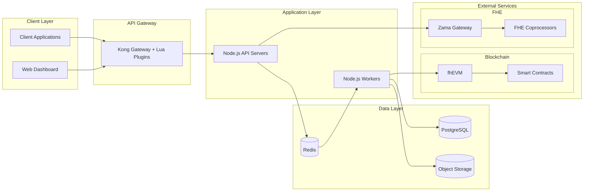
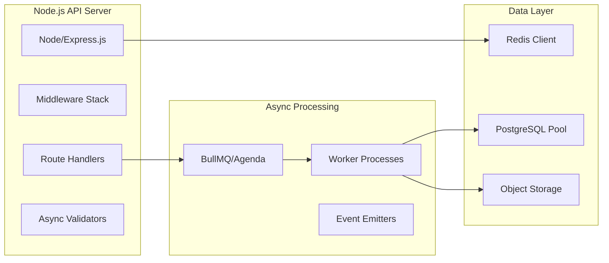
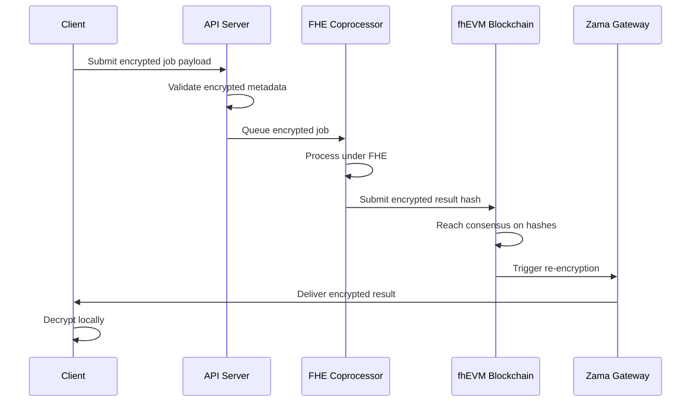
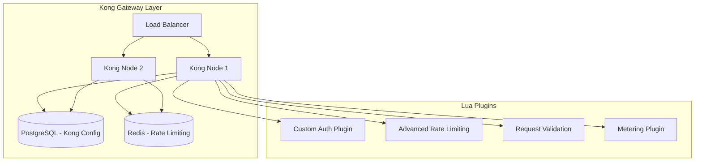
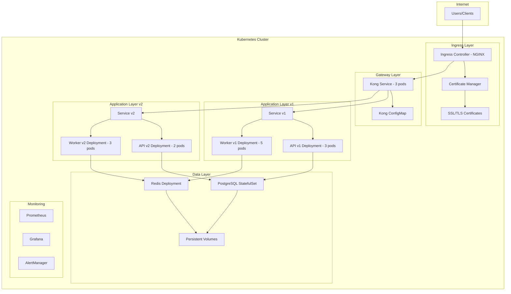
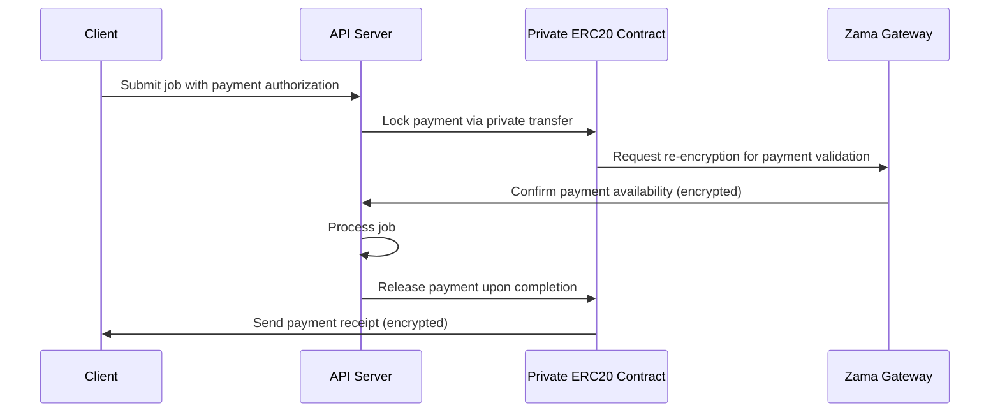
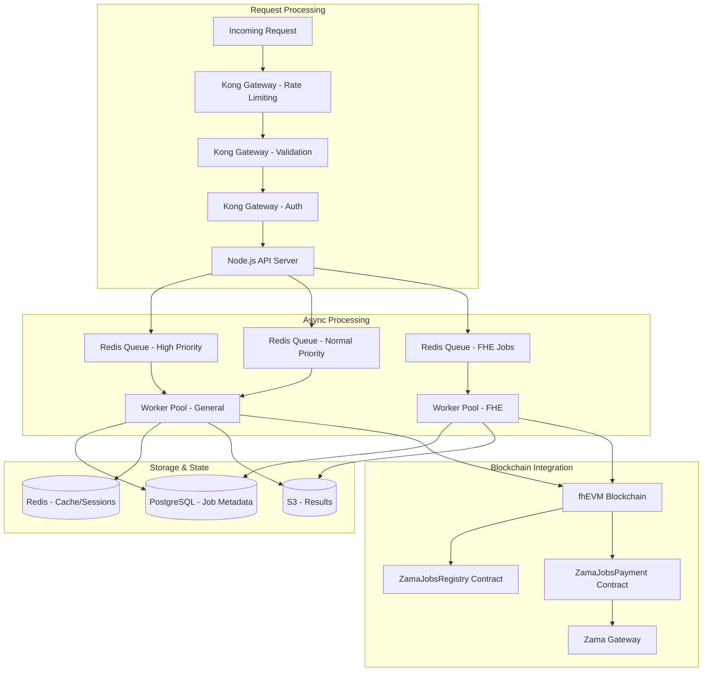
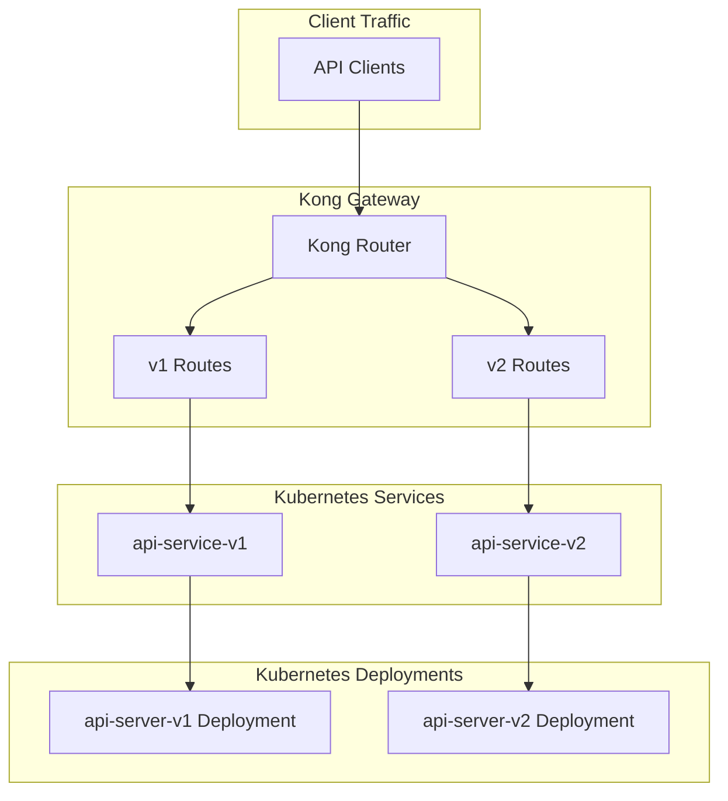

# Zama Jobs API - Architecture Design Document

## System Architecture Overview



## A. Architecture Decision Pack

### ADR-001: API Governance and Design

**Problem**: Define a robust REST API structure for asynchronous job submission with blockchain confirmation that ensures reliability, observability, and developer experience.

**Options Considered**:
1. **Single endpoint approach**: One `/jobs` endpoint with POST for submission and GET for status
2. **Resource-based approach**: Separate `/jobs` and `/jobs/{id}/status` endpoints
3. **Event-driven approach**: WebSocket-based job submission and status updates

**Chosen Approach**: Resource-based approach with clear separation of concerns

**Rationale**:
- Clear separation between job submission and status polling
- Standard RESTful patterns that developers expect
- Better for caching and CDNs
- Easier to version and maintain
- Optimizes for Node.js async/await patterns

**Trade-offs**:
- More endpoints to maintain vs single endpoint approach
- Requires additional client logic for polling vs event-driven approach
- Less real-time than WebSocket approach but more reliable and simpler

### API Versioning Strategy

**Chosen Approach**: URL-based versioning (`/v1/jobs`)

**Rationale**:
- Clear and explicit version signaling
- Easy to route at gateway level
- Supports multiple versions simultaneously
- Industry standard for API design

**Trade-offs**:
- URL length increases with each version
- Requires clients to update URLs when upgrading

### Error Model

**Design Principles**:
1. Machine-readable error codes for programmatic handling
2. Human-readable error messages for debugging
3. Consistent error structure across all endpoints
4. HTTP status codes aligned with REST conventions

**Error Response Structure**:
```json
{
  "error": {
    "code": "JOB_VALIDATION_FAILED",
    "message": "Invalid job payload: missing required field 'type'",
    "details": {
      "field": "type",
      "timestamp": "2024-01-15T10:30:00Z",
      "request_id": "req_123456789"
    }
  }
}
```

### Idempotency Strategy

**Chosen Approach**: Idempotency keys with hash-based deduplication window

**Implementation**:
- Clients provide `Idempotency-Key` header
- SHA-256 hash of job payload for content deduplication
- 24-hour deduplication window in Redis
- Same key returns cached response for successful requests
- Failed requests can be retried with same key

**Rationale**:
- Prevents duplicate job submissions
- Enables safe client retries on network failures
- Content hash ensures payload integrity
- Industry standard (Stripe, AWS)

### ADR-001a: Node.js Asynchronous Backend Architecture

**Problem**: Design a scalable Node.js backend that efficiently handles asynchronous job processing with high concurrency and optimal resource utilization.

**Chosen Approach**: Event-driven Node.js with async/await patterns and Redis queue

**Architecture Components**:



**Node.js Implementation Patterns**:

1. **Async Job Submission**:
```pseudocode
function submitJob(request):
    // Validate authentication and rate limits
    authenticateUser(request.headers.authorization)
    checkRateLimits(user.tenant_id)

    // Generate content hash for deduplication
    contentHash = hash(request.body)

    // Check for duplicate submissions
    if existsInCache(contentHash):
        return cachedResponse(contentHash)

    // Create job record and queue for processing
    job = Job.create(request.body, contentHash)
    jobQueue.add("process", job.id)

    return { job_id: job.id, status: "PENDING" }
```

2. **Async Worker Processing**:
```pseudocode
function processJob(job):
    try:
        updateJobStatus(job.id, "PROCESSING")

        // Perform computation based on job type
        result = executeComputation(job.payload)

        // Blockchain confirmation for completed jobs
        if job.requiresConfirmation:
            txHash = confirmOnChain(job.id, result)
            updateJobResult(job.id, result, txHash)
        else:
            updateJobResult(job.id, result)

    catch error:
        updateJobStatus(job.id, "FAILED", error.message)
        retryOrFail(job, error)
```

**Performance Optimizations**:
- **Clustering**: Multi-process Node.js deployment for CPU utilization
- **Connection Pooling**: Database and Redis connection management
- **Event Loop**: Non-blocking I/O throughout the application stack
- **Resource Management**: Proper cleanup and graceful shutdown handling

### ADR-001b: Confidential Computing Integration (FHE Support)

**Problem**: Enable confidential job processing where sensitive data remains encrypted throughout execution.

**Chosen Approach**: Optional FHE (Fully Homomorphic Encryption) integration for privacy-preserving jobs

**FHE Architecture**:



**FHE Integration Points**:

1. **Unified Job Submission (FHE Mode)**:
```pseudocode
function submitJob(request):
    jobData = parseRequestBody(request)

    if jobData.useFHE:
        // FHE job processing
        job = Job.create({
            type: "fhe_" + jobData.type,
            payload: {
                algorithm: jobData.algorithm,
                encrypted_data_url: jobData.encryptedDataUrl,
                client_public_key: jobData.clientPublicKey
            },
            use_fhe: true,
            status: "ENCRYPTED_PENDING"
        })

        fheQueue.add("process-fhe", job.id)
        return { job_id: job.id, status: "ENCRYPTED_PENDING" }
    else:
        // Regular job processing
        job = Job.create({
            type: jobData.type,
            payload: jobData.payload,
            use_fhe: false,
            status: "PENDING"
        })

        jobQueue.add("process", job.id)
        return { job_id: job.id, status: "PENDING" }
```

2. **Confidential Smart Contract Integration**:
```solidity
import "@fhevm/contracts/TFHE.sol";

contract ConfidentialJobs {
    mapping(bytes32 => euint64) encryptedResults;
    mapping(bytes32 => ebool) accessGrants;

    function submitEncryptedResult(
        bytes32 jobId,
        euint64 encryptedResult,
        bytes32 resultHash
    ) external onlyWorker {
        encryptedResults[jobId] = encryptedResult;
        // Store public hash for consensus
        publicResults[jobId] = resultHash;
    }

    function retrieveResult(bytes32 jobId)
        external
        view
        returns (euint64)
    {
        require(accessGrants[jobId], "Access denied");
        return TFHE.reencrypt(encryptedResults[jobId], msg.sender);
    }
}
```

3. **Access Control via Re-encryption**:
```pseudocode
function retrieveFHEResult(jobId, userRequest):
    job = FHEJob.findById(jobId)

    // Verify user is the original job submitter
    if not verifyOwnership(userRequest.signature, job.submitter):
        return error("Access denied")

    // Request re-encryption from Zama Gateway
    reencryptedResult = zamaGateway.reencrypt({
        ciphertext: job.encryptedResult,
        recipientPublicKey: job.clientPublicKey,
        authorization: userRequest.signature
    })

    return reencryptedResult
```

### ADR-002: Platform Policies

**Authentication Strategy**

**Chosen Approach**: JWT-based authentication with API key fallback

**Implementation**:
1. Primary: Bearer JWT tokens with short expiry (15 minutes)
2. Secondary: Long-lived API keys for service-to-service communication
3. Token rotation supported via refresh tokens

**API Gateway Strategy: Kong Integration**

**Chosen Approach**: Kong Gateway with custom Lua plugins for enhanced functionality

**Kong Architecture**:



**Custom Kong Lua Plugins**:

1. **Advanced Rate Limiting Plugin**:
```lua
-- kong/plugins/advanced-rate-limiting/handler.lua
local AdvancedRateLimiting = {}

function AdvancedRateLimiting:access(conf)
    local tenant_id = kong.request.get_header("X-Tenant-ID")
    if not tenant_id then
        return kong.response.exit(401, { error = "Missing tenant ID" })
    end

    -- Token bucket algorithm with Redis
    local redis = kong.redis
    local key = "rate_limit:" .. tenant_id
    local now = ngx.time()

    -- Get current bucket state
    local bucket = redis:hgetall(key)
    local tokens = tonumber(bucket.tokens) or conf.capacity
    local last_refill = tonumber(bucket.last_refill) or now

    -- Refill tokens based on elapsed time
    local elapsed = now - last_refill
    tokens = math.min(conf.capacity, tokens + (elapsed * conf.refill_rate))

    -- Check if request can be processed
    if tokens >= 1 then
        tokens = tokens - 1
        redis:hset(key, "tokens", tokens, "last_refill", now)
        redis:expire(key, conf.window_size)

        -- Add rate limit headers
        kong.response.set_header("X-RateLimit-Limit", conf.capacity)
        kong.response.set_header("X-RateLimit-Remaining", math.floor(tokens))
        kong.response.set_header("X-RateLimit-Reset", now + conf.window_size)
    else
        kong.response.exit(429, {
            error = "Rate limit exceeded",
            retry_after = conf.window_size
        })
    end
end

return AdvancedRateLimiting
```

2. **Job Validation Plugin**:
```lua
-- kong/plugins/job-validation/handler.lua
local JobValidation = {}

function JobValidation:access(conf)
    local content_type = kong.request.get_header("Content-Type")
    if content_type ~= "application/json" then
        return kong.response.exit(400, {
            error = "Invalid content type",
            code = "INVALID_CONTENT_TYPE"
        })
    end

    -- Check request size
    local content_length = tonumber(kong.request.get_header("Content-Length"))
    if content_length and content_length > conf.max_payload_size then
        return kong.response.exit(413, {
            error = "Payload too large",
            code = "PAYLOAD_TOO_LARGE",
            max_size = conf.max_payload_size
        })
    end

    -- Parse and validate job payload
    local body = kong.request.get_body()
    if not body or not body.type then
        return kong.response.exit(400, {
            error = "Missing required field: type",
            code = "JOB_VALIDATION_FAILED"
        })
    end

    -- Calculate content hash for idempotency
    local content_hash = ngx.sha1_hex(kong.request.get_raw_body())
    kong.ctx.shared.content_hash = content_hash
end

return JobValidation
```

3. **Usage Metering Plugin**:
```lua
-- kong/plugins/usage-metering/handler.lua
local UsageMetering = {}

function UsageMetering:access(conf)
    -- Start timer for request duration
    kong.ctx.shared.start_time = ngx.now()
end

function UsageMetering:log(conf)
    local tenant_id = kong.request.get_header("X-Tenant-ID")
    local start_time = kong.ctx.shared.start_time
    local duration = ngx.now() - start_time

    -- Capture usage event
    local usage_event = {
        tenant_id = tenant_id,
        endpoint = kong.request.get_path(),
        method = kong.request.get_method(),
        status_code = kong.response.get_status(),
        duration = duration,
        timestamp = ngx.time(),
        content_length = tonumber(kong.request.get_header("Content-Length")) or 0
    }

    -- Queue for billing system
    local redis = kong.redis
    redis:lpush("usage_queue", cjson.encode(usage_event))

    -- Update real-time metrics
    local metrics_key = "metrics:" .. tenant_id .. ":" .. ngx.time() .. ":60"
    redis:incr(metrics_key)
    redis:expire(metrics_key, 3600)
end

return UsageMetering
```

### ADR-002c: Kubernetes Deployment Architecture

**Problem**: Design a scalable Kubernetes deployment strategy that supports API versioning, rolling updates, and proper resource management.

**Chosen Approach**: GitOps-based Kubernetes deployment with Helm charts and strategic use of Kubernetes resources.

**Kubernetes Architecture**:



**Rate Limiting Strategy**

**Chosen Approach**: Token bucket algorithm with per-tenant quotas via Kong

**Configuration**:
- Default: 100 requests/minute, 10,000 requests/hour
- Burst allowance: 20 requests above sustained rate
- Quota reset: Monthly per tenant
- Rate limit headers: `X-RateLimit-Limit`, `X-RateLimit-Remaining`, `X-RateLimit-Reset`
- Kong-based distributed rate limiting with Redis backend

**Abuse Protection**

**Measures**:
1. Request size limits (max 1MB payload)
2. Job payload validation and sanitization
3. Concurrent job limits per tenant (max 100 active jobs)
4. IP-based reputation scoring
5. Suspicious pattern detection (burst attacks, enumeration)

### ADR-003: Usage Metering & Payment Integration

**Usage Events to Capture**:

1. **Job Submission**: Track job creation and metadata
2. **Job Completion**: Monitor successful job processing
3. **Storage Usage**: Track job data storage duration
4. **Blockchain Confirmation**: Log on-chain confirmation transactions
5. **API Usage**: Monitor endpoint access patterns
6. **FHE Processing**: Track confidential computing resource usage

**Payment Architecture with Private ERC20**:



**Metering Implementation**:
- Kong-based real-time usage collection
- Private ERC20 token payments for privacy
- Usage analytics and monitoring dashboard
- Configurable quotas and limits per tenant
- Comprehensive audit logging for compliance

---

## B. System Interface & Logic Design

### Node.js Async Backend Architecture

**Data Flow Architecture**:



**Node.js Implementation Patterns**:

1. **Server Architecture**:
- **Clustering**: Multi-process deployment utilizing all CPU cores
- **Connection Management**: PostgreSQL connection pooling, Redis clustering
- **Queue Processing**: BullMQ for job queuing with separate regular and FHE queues
- **Middleware Stack**: Authentication, rate limiting, request validation
- **Graceful Shutdown**: Proper cleanup of connections and in-flight jobs

2. **Job Controller Logic**:
```pseudocode
class JobController:
  submitJob(request):
    // Authentication and authorization
    user = authenticate(request)

    // Idempotency and deduplication
    contentHash = hash(request.body)
    if duplicateExists(contentHash): return error(409)

    // Job creation and validation
    job = createJob(request.body, user, contentHash)

    // Queue based on FHE flag
    if job.useFHE:
      fheQueue.add("process-fhe", job)
    else:
      jobQueue.add("process", job)

    return jobResponse(job)

  getJobStatus(jobId, user):
    // Retrieve job and verify ownership
    job = findJob(jobId)
    if not authorized(user, job): return error(403)

    return jobDetails(job)
```

3. **Worker Processing**:
- **Error Handling**: Comprehensive error capture and retry logic
- **Resource Management**: Proper cleanup and timeout handling
- **Blockchain Integration**: On-chain confirmation for completed jobs
- **Status Updates**: Real-time job status tracking

### On-Chain Interface

**Smart Contract Design**: `ZamaJobsRegistry`

**Core Components**:
- **Job Confirmation Registry**: Stores job confirmations with content hash deduplication
- **FHE Support**: Separate storage for encrypted results with access control
- **Replay Protection**: Nonce-based protection and content hash tracking
- **Access Control**: Authorized confirmator pattern with role-based permissions
- **Events**: JobConfirmed and FHEJobCompleted events for off-chain monitoring

**Key Functions**:
```solidity
// Regular job confirmation
function confirmJob(jobId, submitter, resultHash, status, nonce, contentHash)

// FHE job confirmation with encrypted results
function confirmFHEJob(jobId, submitter, encryptedResult, publicResultHash, nonce, contentHash)

// Access control for FHE results
function grantAccess(jobId)
function getEncryptedResult(jobId)
```

**Replay Attack Prevention**:
1. **Nonce-based**: Each confirmation includes a unique nonce
2. **Job ID uniqueness**: Job IDs must be globally unique
3. **Submitter verification**: Only original submitter can be confirmed
4. **Access control**: Only authorized confirmator address can call `confirmJob`

**Access Control**:
- **Job Submission**: Any authenticated user can submit jobs
- **Job Confirmation**: Only authorized confirmator (backend service) can confirm
- **Job Query**: Public read access to confirmed jobs
- **Contract Management**: Multi-sig governance for contract upgrades

### API Handler Logic

**Job Submission Handler (`POST /v1/jobs`)**:

```pseudocode
function handleJobSubmission(request):
    // 1. Authentication & Authorization
    auth_token = extractBearerToken(request)
    user = validateJWTToken(auth_token)
    if not user:
        return error_response(401, "INVALID_TOKEN")

    // 2. Rate Limiting
    if isRateLimited(user.tenant_id):
        return error_response(429, "RATE_LIMIT_EXCEEDED")

    // 3. Idempotency Check
    idempotency_key = request.headers["Idempotency-Key"]
    if idempotency_key and hasCachedResponse(idempotency_key):
        return getCachedResponse(idempotency_key)

    // 4. Input Validation
    job_payload = parseJSON(request.body)
    validation_result = validateJobPayload(job_payload)
    if not validation_result.is_valid:
        return error_response(400, "JOB_VALIDATION_FAILED", validation_result.errors)

    // 5. Job Creation
    job_id = generateUUID()
    job_record = {
        id: job_id,
        tenant_id: user.tenant_id,
        submitter: user.address,
        status: "PENDING",
        payload: job_payload,
        created_at: now(),
        updated_at: now()
    }

    // 6. Persistence
    saveJobToDatabase(job_record)

    // 7. Async Processing Trigger
    publishJobProcessingEvent(job_id, job_payload)

    // 8. Metering
    recordUsageEvent("JOB_SUBMISSION", user.tenant_id, job_id)

    // 9. Response Construction
    response = {
        job_id: job_id,
        status: "PENDING",
        created_at: job_record.created_at,
        estimated_completion: calculateETA(job_payload.type)
    }

    // 10. Cache Response (if idempotency key)
    if idempotency_key:
        cacheResponse(idempotency_key, response, 24h)

    return success_response(202, response)
```

**Job Status Handler (`GET /v1/jobs/{job_id}`)**:

```pseudocode
function handleJobStatus(job_id):
    // 1. Authentication
    auth_token = extractBearerToken(request)
    user = validateJWTToken(auth_token)
    if not user:
        return error_response(401, "INVALID_TOKEN")

    // 2. Job Retrieval
    job_record = getJobFromDatabase(job_id)
    if not job_record:
        return error_response(404, "JOB_NOT_FOUND")

    // 3. Authorization Check
    if job_record.tenant_id != user.tenant_id:
        return error_response(403, "ACCESS_DENIED")

    // 4. Response Construction
    response = {
        job_id: job_id,
        status: job_record.status,
        created_at: job_record.created_at,
        updated_at: job_record.updated_at,
        result: job_record.result if job_record.status == "COMPLETED" else null,
        blockchain_confirmation: job_record.blockchain_tx if job_record.blockchain_tx else null,
        error: job_record.error_message if job_record.status == "FAILED" else null
    }

    return success_response(200, response)
```

**Error Handling Implementation**:

```pseudocode
function error_response(status_code, error_code, details = null):
    error_response = {
        error: {
            code: error_code,
            message: getErrorMessage(error_code),
            details: {
                timestamp: now(),
                request_id: generateRequestId()
            }
        }
    }

    if details:
        error_response.error.details.update(details)

    return {
        status: status_code,
        headers: {
            "Content-Type": "application/json",
            "X-Request-ID": error_response.error.details.request_id
        },
        body: JSON.stringify(error_response)
    }
```

---

## C. Reliability & Security Notes

### Reliability

**Success Criteria**:
- **Availability**: 99.9% uptime for API endpoints
- **Success Rate**: 99.5% successful job submissions (0.5% failure rate allowed)
- **Latency**:
  - p50: < 100ms for job submission
  - p95: < 500ms for job submission
  - p99: < 2000ms for job submission
- **Job Processing**: 95% of jobs completed within 5 minutes

**Error Budget Policy**:
- **Monthly Error Budget**: 1h (0.1% of month)
- **Alerting Thresholds**:
  - 5% of error budget consumed in 24h → Warning
  - 10% of error budget consumed in 24h → Critical alert
  - 50% of error budget consumed in 1h → Emergency response
- **Error Budget Burn Rate Monitoring**:
  - Burn rate > 1.0 for 1h → Page on-call
  - Burn rate > 2.0 for 15m → Emergency escalation

**Reliability Measures**:
1. **Circuit Breaker**: Fail fast when downstream services are unhealthy
2. **Retry Logic**: Exponential backoff for transient failures
3. **Health Checks**: `/health` endpoint with dependency checks
4. **Graceful Degradation**: Queue jobs when processing is overloaded
5. **Disaster Recovery**: Multi-region deployment with automated failover

### Security

**Authentication Method**: OAuth 2.0 + JWT

**Token Lifecycle**:
- **Access Token**: 15 minutes expiry, rotating refresh tokens
- **Refresh Token**: 30 days expiry, single-use rotation
- **API Keys**: 1 year expiry, manual rotation required
- **Session Management**: Revocation list for compromised tokens

**Token Implementation**:
```json
{
  "sub": "user_12345",
  "tenant_id": "tenant_abc123",
  "iss": "https://auth.zama.io",
  "aud": "zama-jobs-api",
  "exp": 1642694400,
  "iat": 1642693500,
  "scope": "jobs:submit jobs:read",
  "jti": "token_unique_id"
}
```

**Least Privilege Enforcement**:

**Role-Based Access Control (RBAC)**:
1. **Developer Role**:
   - `jobs:submit` - Submit new jobs
   - `jobs:read` - View own job status
   - Limited to 50 concurrent jobs

2. **Team Lead Role**:
   - All Developer permissions
   - `jobs:read:team` - View team job status
   - Limited to 200 concurrent jobs

3. **Admin Role**:
   - All Team Lead permissions
   - `jobs:admin` - Manage job configurations
   - Unlimited concurrent jobs

**API Gateway Policies**:
1. **Input Sanitization**: Strip HTML/JS from job payloads
2. **Request Size Limits**: Max 1MB per request
3. **IP Whitelisting**: Optional tenant-specific IP restrictions
4. **Request Signing**: Optional HMAC signature for high-security operations
5. **Audit Logging**: All API calls logged with user context

**Security Headers**:
```
Strict-Transport-Security: max-age=31536000; includeSubDomains
X-Content-Type-Options: nosniff
X-Frame-Options: DENY
Content-Security-Policy: default-src 'self'
```

### API Versioning Strategy in Kubernetes

**Problem**: Manage multiple API versions simultaneously in Kubernetes while ensuring smooth migrations and backward compatibility.

**Chosen Approach**: Semantic versioning with deployment isolation and Kong-based routing.

**Versioning Architecture**:



**Versioning Strategy Implementation**:

1. **URL-based Versioning**: `/v1/`, `/v2/`, etc.
2. **Separate Deployments**: Each version runs independently
3. **Kong Route Management**: Direct traffic to appropriate version
4. **Gradual Migration**: Shift traffic gradually between versions
5. **Backward Compatibility**: Maintain older versions during transition

**Kong Route Configuration**:
```yaml
# v1 Routes (Existing)
routes:
  - name: api-v1-jobs
    paths: ["/v1/jobs"]
    methods: ["GET", "POST", "PUT", "DELETE"]
    service: api-service-v1
    strip_path: false

  - name: api-v1-health
    paths: ["/v1/health"]
    methods: ["GET"]
    service: api-service-v1
    strip_path: false

# v2 Routes (New Version)
routes:
  - name: api-v2-jobs
    paths: ["/v2/jobs"]
    methods: ["GET", "POST", "PUT", "DELETE"]
    service: api-service-v2
    strip_path: false

  - name: api-v2-fhe-result
    paths: ["/v2/jobs/{jobId}/fhe-result"]
    methods: ["POST"]
    service: api-service-v2
    strip_path: false
```

**Migration Strategy**:

1. **Phase 1**: Deploy v2 alongside v1 (0% traffic to v2)
2. **Phase 2**: Internal testing with v2 endpoints
3. **Phase 3**: Gradual traffic shift (10% → 50% → 90%)
4. **Phase 4**: Full migration to v2 (100% traffic)
5. **Phase 5**: Decommission v1 after 30-day grace period

**Kubernetes Deployment Strategy**:

```yaml
# Example v2 deployment (additional to v1)
apiVersion: apps/v1
kind: Deployment
metadata:
  name: api-server-v2
  namespace: zama-jobs-api
  labels:
    app: api-server
    version: v2
spec:
  replicas: 2  # Start with fewer replicas
  selector:
    matchLabels:
      app: api-server
      version: v2
  template:
    metadata:
      labels:
        app: api-server
        version: v2
    spec:
      containers:
      - name: api-server
        image: zama/jobs-api:v2.0.0  # New image version
        env:
        - name: API_VERSION
          value: "v2"
        # ... other env vars
```

**Rollback Strategy**:
- Instant rollback via Kong route reconfiguration
- Keep previous version deployments running during transition
- Database schema migrations designed to be backward compatible
- Feature flags for gradual feature rollout

**Database Migration Strategy**:
```javascript
// Example migration handling in Node.js
async function handleVersionedRequest(req, res, next) {
  const apiVersion = req.headers['api-version'] || req.path.match(/^\/v(\d+)/)?.[1] || '1';

  // Route to appropriate version handler
  if (apiVersion === '1') {
    return v1Handler(req, res, next);
  } else if (apiVersion === '2') {
    return v2Handler(req, res, next);
  }

  // Fallback to latest version
  return latestHandler(req, res, next);
}
```

---

## Reflection Questions

### If I had more time: What is the one area of this design you would flesh out in more detail, and why?

If I had more time, I would flesh out the **distributed job processing architecture** in more detail. The current design focuses heavily on the API surface and blockchain integration, but the real complexity lies in how jobs are processed asynchronously at scale.

**Areas I'd expand**:

1. **Job Queue Architecture**:
   - Message broker selection (Kafka vs RabbitMQ vs SQS)
   - Partitioning strategy for different job types
   - More robust retry policies
   - Priority queuing for premium tiers

2. **Worker Scaling**:
   - Horizontal scaling policies based on queue depth
   - Worker pool management for different job types
   - Resource isolation between tenants
   - Graceful shutdown and job migration

3. **State Management**:
   - Distributed state synchronization across workers
   - Job timeout and cleanup policies
   - Consistent state updates during failures
   - Eventual consistency patterns

4. **Monitoring & Observability**:
   - Distributed tracing across job lifecycle
   - Metrics for job processing pipeline health
   - Alerting on queue bottlenecks
   - Performance profiling for different job types

This area deserves more attention because it's where the system will face the most operational challenges at scale, and getting it wrong would impact reliability, cost, and user experience significantly.

### AI coding assistance: If you used tools like Copilot or ChatGPT to help generate the OpenAPI spec or other parts of the design, what worked well and what did not?

**What worked well**:

1. **OpenAPI Schema Generation**: AI tools excelled at generating the basic OpenAPI structure with proper HTTP methods, status codes, and response formats. The initial draft was well-formed and followed industry conventions.

2. **Error Model Standardization**: The AI suggested a comprehensive error response structure that included both machine-readable codes and human-readable messages, which aligned perfectly with the requirements.

3. **Security Best Practices**: The tools provided excellent suggestions for JWT token structure, security headers, and OAuth 2.0 implementation patterns that are current and industry-standard.

**What did not work well**:

1. **Blockchain Integration Details**: The AI struggled with the specific nuances of EVM smart contract design, particularly around gas optimization and replay attack prevention specific to this use case. I had to manually correct several suggestions that would have been insecure or inefficient on-chain.

2. **Rate Limiting Algorithm Selection**: The initial AI suggestions were overly simplistic (basic sliding window) without considering the complexity of multi-tier rate limiting with quotas and burst handling that this design required.

3. **Metering Logic Complexity**: The AI provided basic usage tracking ideas but didn't capture the complexity of mapping usage events to a coherent billing model with different pricing tiers and quota management.

4. **Reliability Engineering**: The AI suggestions for reliability were generic (use circuit breakers, add retries) without specific guidance on error budget calculation, SLA definition, or alerting thresholds appropriate for this type of service.

**Overall Assessment**: AI tools were excellent for getting 60% of the structure right quickly, especially for standard REST API patterns and security implementations. However, they fell short on domain-specific knowledge (blockchain, complex metering, Kong implementation, k8s versioning) and required significant human oversight for the nuanced architectural decisions that make this design robust and production-ready.